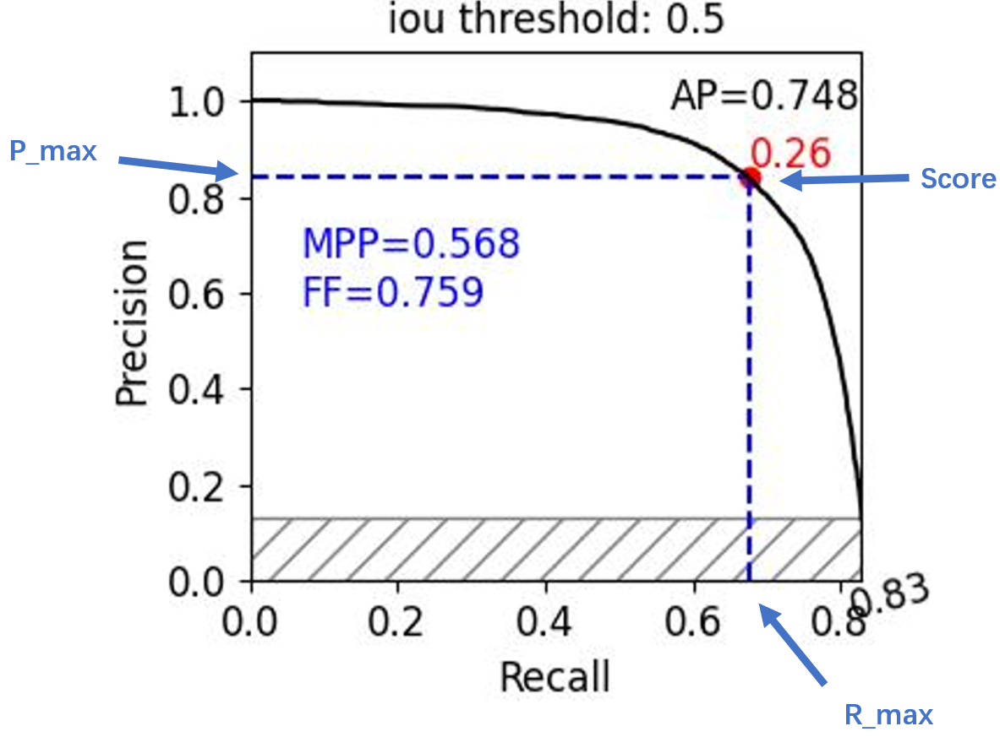

## COCO_improved
An improved mAP measurement tool for COCO object detection and instance segmentation.

  


## Prepare
```
pip install pycocotools
```

## Illustration
  
AP: average precision, the area under the balck solid curve: PR curve, the same as official COCO API measurement.  
MPP: max practical precision, a self-named calling, the max area rectangle under the PR curve  
FF: fill factor, MPP/AP  
P_max: the precision corresponding with MPP  
R_max: the recall corresponding with MPP  
Score: the class score corresponding with MPP  
[A good project which help understand the method of calculating mAP.](https://github.com/rafaelpadilla/Object-Detection-Metrics)

## Demo  
- Download ["all_detections.json"](pass) first.
- Directly run "val_with_json.py" in your IDE.  
```
from pycocotools.coco import COCO
from cocoeval import SelfEval
coco = COCO('D:/Data/coco2017/annotations/instances_val2017.json')

coco_dt = coco.loadRes('all_detections.json')
bbox_eval = SelfEval(coco, coco_dt, all_points=True, iou_type='bbox')
bbox_eval.evaluate()
bbox_eval.accumulate()
bbox_eval.summarize()
bbox_eval.draw_curve()

segm_eval = SelfEval(coco, coco_dt, all_points=True, iou_type='segmentation')
segm_eval.evaluate()
segm_eval.accumulate()
segm_eval.summarize()
segm_eval.draw_curve()
```
- You can pass your own "result.json" to it to measure the mAP.
- For "all_points=False", a total of 101 points on PR curve are calculated, which is what the official COCO API does.  
- For "all_points=True", all the points on PR curve are calculated, so you can get the most accurate value. 
- Note that, for mAP, with "all_points=False", you can get the same value as the official COCO API does, and the most accurate value with "all_points=True". But for AR, there's always a minor difference because of a different calculation method.  


